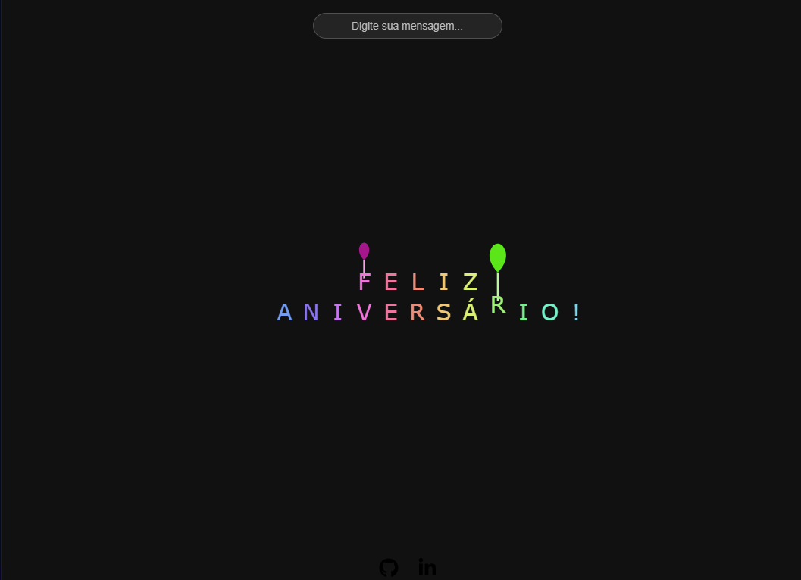

# 🎆 Fireworks Message Generator

<p align="center">
  
</p>

<p align="center">
  <a href="https://paulapsox.github.io/fireworks-message-generator/">
    
  </a>
  <a href="https://github.com/paulaPSOx/fireworks-message-generator">
    
  </a>
</p>

<p align="center">
  
  
  
  
</p>

---

# 📖 Sobre o projeto

**Fireworks Message Generator** é uma animação interativa de **fogos de artifício criada com JavaScript e Canvas API** que forma mensagens personalizadas no centro da tela.

O usuário pode digitar uma frase e visualizar **fogos que sobem, explodem e revelam letras animadas**, criando um efeito visual dinâmico.

Também é possível **clicar na tela para gerar fogos adicionais manualmente**.

---

# ✨ Funcionalidades

- 🎆 Animação de fogos de artifício usando Canvas  
- ✍️ Campo para inserir mensagens personalizadas  
- 🔠 Formação de letras após a explosão  
- 🎈 Balões animados após a explosão das letras  
- 🖱️ Clique na tela para lançar fogos extras  
- 📱 Layout responsivo  

---

# 🛠 Tecnologias utilizadas

<p>
  
  
  
  
</p>

---

# 🚀 Acessar o projeto

Projeto online:

https://paulapsox.github.io/fireworks-message-generator/

Repositório:

https://github.com/paulaPSOx/fireworks-message-generator

---

# ⚙️ Como executar o projeto

### 1️⃣ Clonar o repositório

```bash
git clone https://github.com/paulaPSOx/fireworks-message-generator.git
```

### 2️⃣ Entrar na pasta do projeto

```bash
cd fireworks-message-generator
```

### 3️⃣ Abrir o projeto

Abra o arquivo:

```
index.html
```

em qualquer navegador moderno.

---

# 📁 Estrutura do projeto

```
fireworks-message-generator
│
├── index.html
│
├── css
│   └── style.css
│
├── script.js
│
├── img-fireworks-message-generator.png
│
└── imagens
    └── icones
        ├── github.svg
        ├── linkedin-in.svg
        └── icone.png
```

---

# 🎇 Funcionamento da animação

Cada letra da mensagem passa por **quatro fases de animação**.

### 1️⃣ Lançamento do foguete

Um foguete sobe da parte inferior da tela até o ponto onde a letra será exibida.

Durante o trajeto é desenhado um **rastro luminoso animado**.

---

### 2️⃣ Explosão

Ao chegar ao destino ocorre uma explosão composta por **partículas animadas**.

Essas partículas possuem:

- velocidade  
- gravidade  
- rastro animado  

---

### 3️⃣ Aparição da letra

Após a explosão, a letra aparece no centro da animação.

---

### 4️⃣ Balão

Depois de alguns segundos:

- um balão surge abaixo da letra  
- ele infla  
- sobe pela tela até desaparecer  

---

# 📱 Responsividade

O layout foi adaptado para diferentes tamanhos de tela utilizando **media queries**.

Breakpoints utilizados:

- 768px — tablets  
- 480px — mobile  
- 360px — telas pequenas  

---

# 🎯 Objetivo do projeto

Este projeto foi desenvolvido como prática de:

- animações com **Canvas API**
- manipulação de partículas
- lógica de animação em **JavaScript**
- interação com o usuário
- organização de código front-end

---

# 👩‍💻 Autora

**Paula Oliveira**

Estudante de **Análise e Desenvolvimento de Sistemas**, com interesse em:

- Desenvolvimento Web  
- Front-end  
- Experiência do Usuário  
- Tecnologia e criatividade  

GitHub  
https://github.com/paulaPSOx

LinkedIn  
https://www.linkedin.com/in/oliveiraspaula/

---

⭐ Se você gostou do projeto, considere **deixar uma estrela no repositório**.
